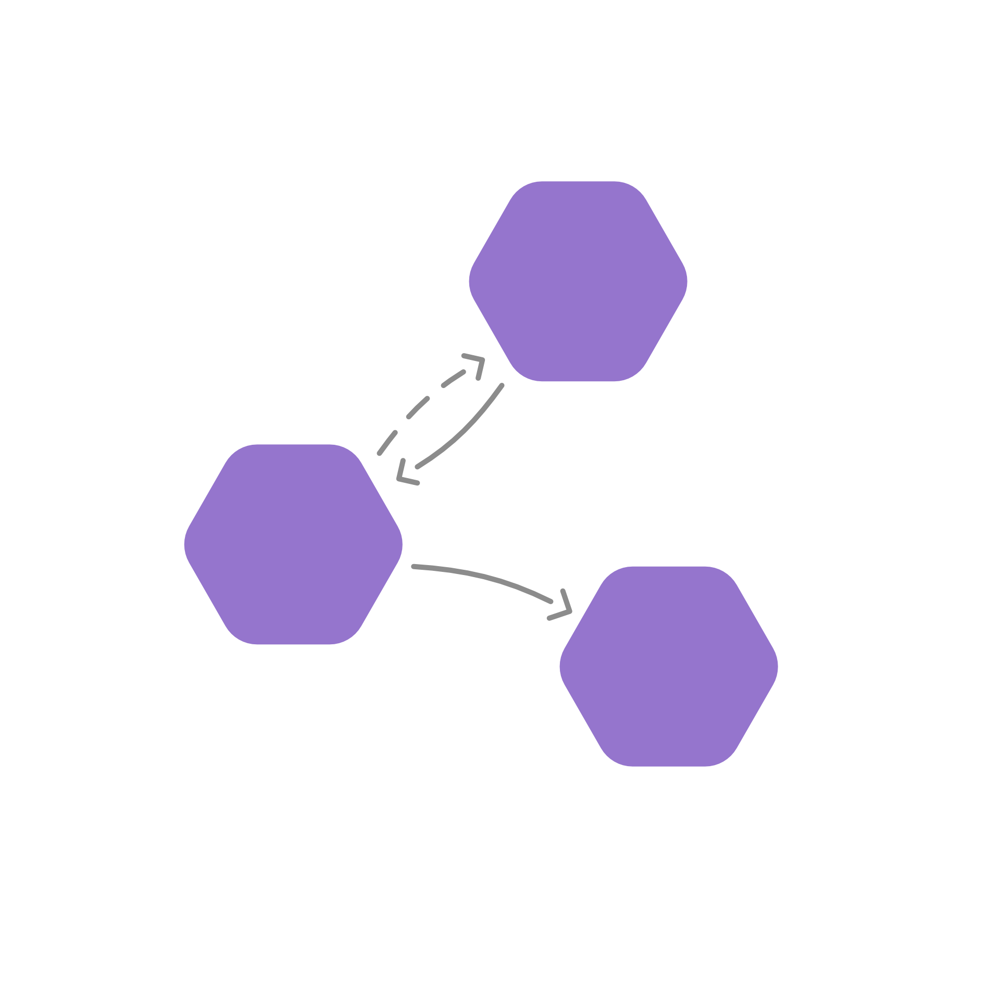

  

# Graphly D3

## Powerful Graph Visualization

Create outstanding graph visualizations with ease

Graphly D3 is an open source frontend library to create outstanding graph visualizations with ease.
It is built on top of [D3.js](https://d3js.org/) and empowers developers to use svg to display any data in a simple and intuitive way.

This is accomplished by providing a shape template system that allows to develop any required node visualization and simply using it in a data-driven manner.

Check out the full [documentation](https://docs.graphly.dev) for more details and examples and a guide to get started.

## Tooling

Graphly D3 is built with TypeScript and [Vite](https://vitejs.dev).
The library is available as a [npm package](https://www.npmjs.com/package/@livereader/graphly-d3) and the source code is available on [GitHub](https://github.com/livereader/graphly-d3)

## Community

You are very welcome to join our [Discord Server](https://discord.gg/NdtkFFRuXa) and ask questions or discuss ideas on how to use Graphly D3 in your projects.
